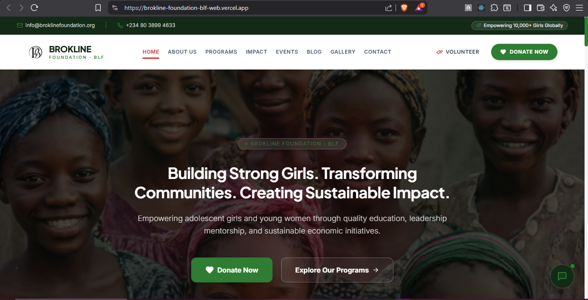

# 🌍 Brokline Foundation (BLF) Website

> A modern, responsive, and impactful NGO website built to empower adolescent girls and young women through education, leadership development, digital inclusion, and sustainable community initiatives.

<p align="center">
  
</p>

<p align="center">
  <strong>Building Strong Girls. Transforming Communities. Creating Sustainable Impact.</strong>
</p>

<p align="center">
  <a href="https://brokline-foundation-blf-web.vercel.app">🌐 Live Website</a> •
  <a href="https://github.com/God-Did-Vel/BROOKLINE-FOUNDATION---BLF">📁 GitHub Repository</a>
</p>

---

## 📖 About the Project

The **Brokline Foundation (BLF)** website is a modern digital platform designed to showcase the foundation's mission, programs, impact, events, and community initiatives while encouraging public engagement through donations, volunteering, and strategic partnerships.

The platform delivers a premium user experience with elegant animations, responsive layouts, accessibility, and high-performance architecture that inspires trust and transparency.

---

## ✨ Key Features

### 🏠 Home

* Modern hero section
* Mission statement
* Call-to-action buttons
* Animated statistics
* Featured programs
* Community highlights
* Success stories
* Partner showcase

---

### 👥 About Us

* Foundation story
* Vision & Mission
* Core values
* Leadership
* Organizational objectives
* Community approach

---

### 🎯 Programs

* Education initiatives
* Leadership development
* Digital literacy
* Economic empowerment
* Community outreach
* Health awareness
* Capacity building

---

### 📊 Impact

* Girls empowered
* Communities reached
* Projects completed
* Active volunteers
* Partners & sponsors
* Annual achievements

---

### 📅 Events

* Community campaigns
* Workshops
* Conferences
* Outreach programs
* Volunteer activities
* Event registration

---

### 📰 Blog & News

* Foundation news
* Success stories
* Articles
* Press releases
* Educational resources

---

### 🖼 Gallery

* Photo gallery
* Community projects
* Outreach campaigns
* Event highlights
* Success moments

---

### ❤️ Donations

* Secure donation page
* Campaign support
* Sponsor opportunities
* Partner registration

---

### 🤝 Volunteer Portal

* Volunteer registration
* Skill-based volunteering
* Community opportunities
* Event participation

---

### 📞 Contact

* Contact form
* Office information
* Email support
* Phone directory
* Google Maps integration
* Social media links

---

## 🎨 Design Highlights

* Elegant modern interface
* Premium NGO branding
* Smooth page transitions
* Beautiful animations
* Responsive design
* Accessibility-focused experience
* Mobile-first approach
* Professional typography
* Clean layouts
* High-performance UI

---

## 🚀 Technology Stack

### Frontend

* Next.js
* React
* TypeScript
* Tailwind CSS
* Framer Motion

### Backend

* Node.js
* Express.js

### Database

* PostgreSQL

### CMS & Storage

* Cloudinary
* Content Management System

### Authentication

* JWT Authentication
* Role-Based Access Control

### Deployment

* Docker
* Nginx
* VPS / Cloud Hosting

---

## 📂 Project Structure

```text
brokline-foundation/
├── app/
├── components/
├── public/
│   └── images/
├── lib/
├── hooks/
├── services/
├── styles/
├── types/
├── utils/
├── README.md
└── package.json
```

---

## 🌐 Live Website

https://brokline-foundation-blf-web.vercel.app

---

## 📁 GitHub Repository

https://github.com/God-Did-Vel/BROOKLINE-FOUNDATION---BLF

---

## ⚙️ Installation

```bash
git clone https://github.com/God-Did-Vel/BROOKLINE-FOUNDATION---BLF

cd brokline-foundation

npm install

npm run dev
```

---

## 📦 Build for Production

```bash
npm run build

npm start
```

---

## 🌱 Future Enhancements

* Online beneficiary application portal
* Donor management dashboard
* Volunteer management system
* Event ticketing & registration
* Online fundraising campaigns
* Newsletter management
* AI-powered virtual assistant
* Multi-language support
* Analytics dashboard
* Impact reporting portal
* Admin CMS
* Partner management system

---

## 🤝 Contributing

Contributions are welcome. If you'd like to improve the project, fix bugs, or introduce new features, feel free to fork the repository, create a new branch, and submit a pull request.

---

## 📄 License

This project is licensed under the **MIT License**.

---

## 👨‍💻 Author

**Vel Mfoniso**

Full Stack Software Engineer

📧 Email: [Mfonisocletus124@gmail.com](mailto:Mfonisocletus124@gmail.com)

💼 GitHub: https://github.com/God-Did-Vel


---

## ❤️ Support the Mission

If you found this project inspiring or useful, please consider giving the repository a **⭐ Star** on GitHub.

Every star helps increase visibility and encourages continued development of impactful digital solutions for communities around the world.

> **"Empowering Girls. Strengthening Communities. Creating Sustainable Impact."**
